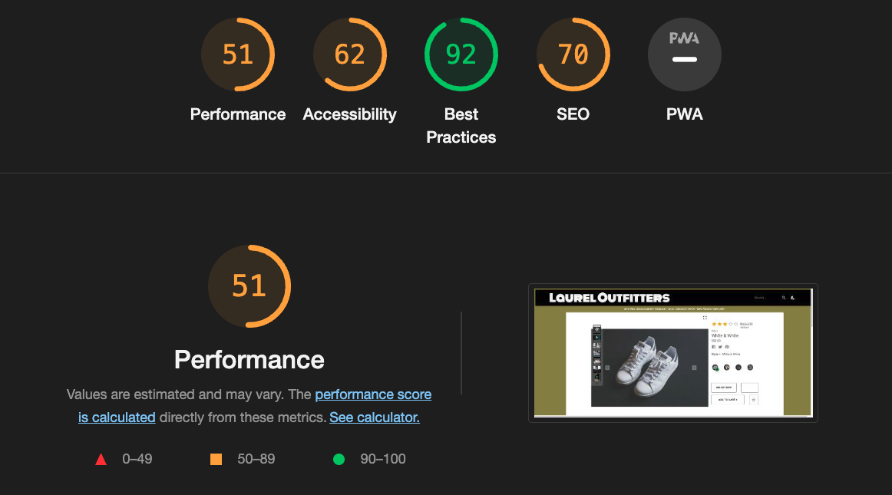

# LLFEC
# Front End Capstone

## Overview

Part of the Hack Reactor Full Stack Immersive Software Engineering program, the Front End Capstone is a comissioned e-commerce site built with React and Express. Created following a business requirements document and an API provided by the project stakeholders, the final product is produced over a three week working period. Beginning with adaptation of agile workflow, a team of three engineers established best practices, held daily standups, and organized workflow using the task management system Trello. This project included the implementation of a number of new technologies to the team including React hooks, Jest, AWS hosting, and Gzip.

## Table of Contents

  - [Tech Stack](#tech-stack)
  - [Features](#features)
    - [Product Overview](#product-overview)
    - [Questions and Answers](#questions-and-answers)
    - [Ratings and Reviews](#ratings-and-reviews)
  - [Development](#development)
    - [Pre-Installation Requirements](#pre-installation-requirements)
    - [Environment Variables Management](#environment-variables-management)
    - [Installation](#installation)
  - [Contributors](#contributors)

## Tech Stack


## Features


***

### Product Overview

> The Product Overview guides the customer through selecting a specific style and size to add to their cart. A popout modal allows the user to view the images at a larger size.


&nbsp;

***

### Questions and Answers

> The Questions and Answers widget allows customers to inquire for further information about a product. They are also able to answer questions and can mark certain questions as helpful. A search feature allows the user to look for specific information.


***

### Ratings and Reviews
> The Ratings & Reviews module is the final widget and allows the user to view current product reviews sorted by submission, relevancy, or helpfulness. A breakdown on the left provides for sorting by rating. Users may view submitted images in a modal for greater detail and can submit their own review with a number of required fields.


&nbsp;

## Development

### Pre-Installation Requirements

```
Node v16.13.1
NPM v8.1.2
```

### Environment Variables Management

This project uses [dotenv](https://github.com/motdotla/dotenv).

The environment variables necessary to run the application can be found in the `.sample-env` file. Modify the variable values in this file in a new `.env` file with a valid GitHub Token and PORT number.

### Installation

From the root directory, run the following commands in your terminal.

1. Install packages:

```
npm install
```

2. To initialize Webpack & Bundle and start the server:
```
npm run build
```

## Lighthouse
At the conclusion of the project, we were able to improve the efficiency of our codebase and utilized Gzip to further compress the application. This resulted in a 21% improvement in our Lighthouse Performance score and reduced our first contentful paint from 10.2ms to 2.2ms.

>Before


>After



## Contributors

* [Greta Grover](https://github.com/grgrover) - Ratings & Reviews
* [Anthony Liang](https://github.com/anthonyliang3) - Questions & Answers
* [Jeremy Biagiotti](https://github.com/Jremedyy) - Product Overview
